## 环境准备

### 前置检查

检查操作系统版本
**window 版本需要大于 1903 ， 否则 wsl gpu docker 启动不起来**
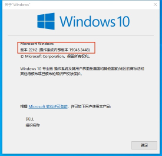

#### 检查命令

打开 CMD
按下 win 键，输入 cmd 后回车，打开「命令提示符」
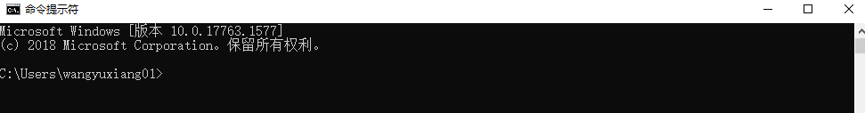

#### 查看系统版本

在打开的 cmd 窗口中，输入 winver 后回车，即可在新弹出的窗口中查看系统版本信息
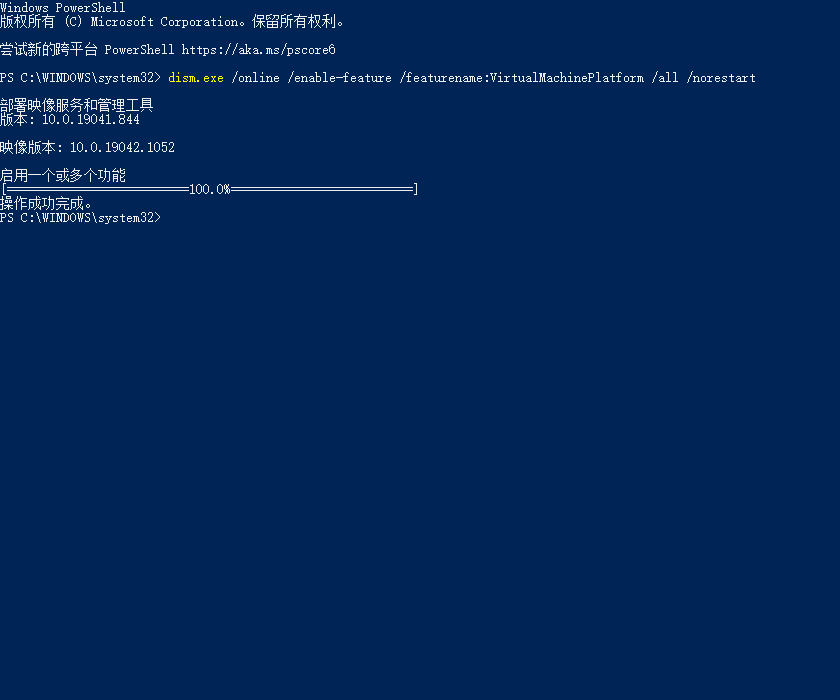

### WSL2 安装

[参考](https://zhuanlan.zhihu.com/p/386590591)
WSL2.0 相比 WSL1.0 具备完整的 Linux 内核、托管 VM 和完全的系统调用兼容性，这里使用 WSL2.0 进行容器的管理

#### 启动组件安装

以管理员身份打开 powershell ，执行如下语句

```bash
dism.exe /online /enable-feature /featurename:Microsoft-Windows-Subsystem-Linux /all /norestart
dism.exe /online /enable-feature /featurename:VirtualMachinePlatform /all /norestart
```

执行完之后重启
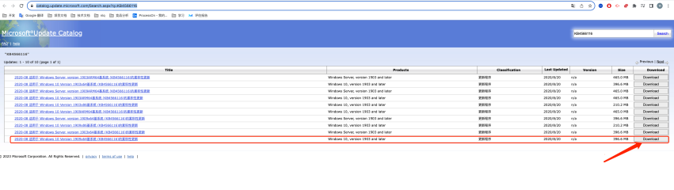

#### 下载 WSL2 Linux 内核

```bash
https://wslstorestorage.blob.core.windows.net/wslblob/wsl_update_x64.msi
```

安装内核

#### 设置 WSL 默认版本

```bash
wsl --set-default-version 2
```

如果提示没有相关命令，可尝试从[https://www.catalog.update.microsoft.com/Search.aspx?q=KB4566116](https://www.catalog.update.microsoft.com/Search.aspx?q=KB4566116)下载 windows 系统更新包，安装后重启后重试是否成功


#### 在线安装 Ubuntu22.04 LTS

1. 打开 Microsoft Store
   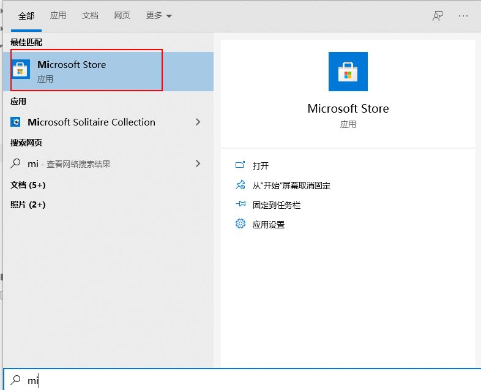
2. 从软件库里面安装 ubuntu 22 ，并且启动 ubuntu

#### 离线安装安装 Ubuntu22.04 LTS

参考 [链接](https://learn.microsoft.com/en-us/windows/wsl/install-manual)
下载 ubuntu 22.04 离线安装包

```json
curl.exe -L -o ubuntu-2204.appx https://aka.ms/wslubuntu2204
```

安装到系统里面

```json
Add-AppxPackage .\ubuntu-2204.appx
```

安装 window terminal 可选

```json
https://learn.microsoft.com/en-us/windows/terminal/install
```

#### 检查 wsl 是否安装成功

执行如下语句，正常输出 ubuntu 已经启动

```bash
wsl -l -v
```

如果这一句报错，说明系统版本有问题

### gpu 驱动安装

如果机器已经安装了驱动，这一步可以省略掉

#### 官网下载驱动

从 nvidia 官网上面下载对应的显卡的驱动
[https://www.nvidia.cn/Download/index.aspx?lang=cn](https://www.nvidia.cn/Download/index.aspx?lang=cn)

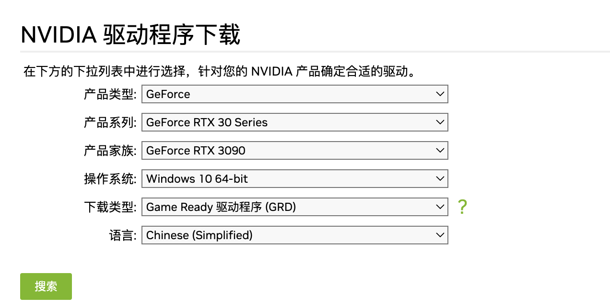
需要选择对应的显卡

#### 校验是否安装成功

执行 nvidia-smi 命令

```bash
nvidia-smi
```

会有如下输出，代表安装成功
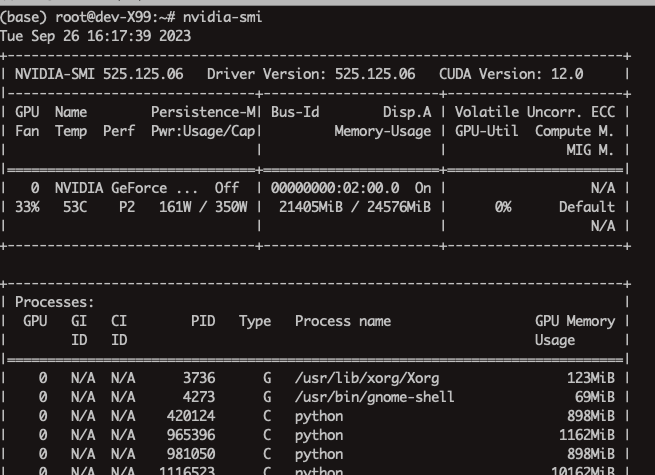

### docker 安装

[参考](https://zhuanlan.zhihu.com/p/646758615)
想要完成 Docker 虚拟化环境的准备，一共分为三步：安装 Docker、配置 WSL2，开始玩。

#### 安装 Docker 应用程序

我们可以从 [Docker 官方网站[2]](https://link.zhihu.com/?target=https%3A//www.docker.com/)，获取到 Docker 应用程序安装包的下载。
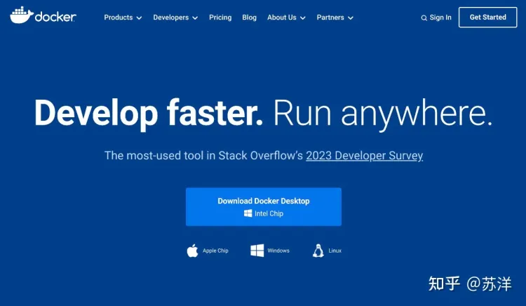

下载完毕之后，“一路 Next” 完成安装后，点击安装程序的“重启按钮”等待程序安装完毕。
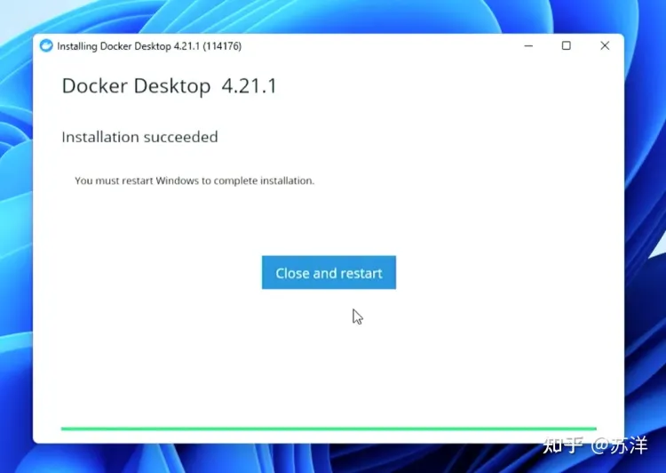
初步安装完毕，需要重启电脑
等待电脑重启完毕

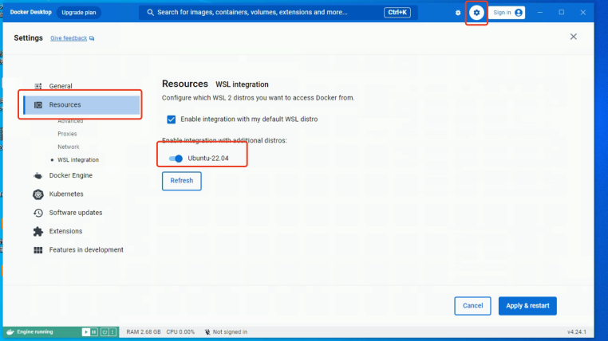
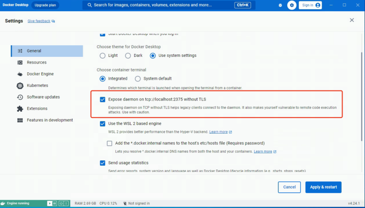

#### 校验是否安装成功

启动 docker

## 系统部署

假设安装目录为 /opt/product

### 下载离线部署包

需要向运维要最新的部署安装包 [下载链接](https://vision-1302847974.cos.ap-shanghai.myqcloud.com/releases/ml_backend_deployment.tar.gz?q-sign-algorithm=sha1&q-ak=AKIDCqGzUiq9XjKfolFO5arv490Vw7KIpWxb&q-sign-time=1695806453;1695979253&q-key-time=1695806453;1695979253&q-header-list=&q-url-param-list=&q-signature=02eaccd45998744d2969c7ee5ce3b2aabf283b3f)

```bash
# 下载部署脚本
wget "https://vision-1302847974.cos.ap-shanghai.myqcloud.com/releases/ml_backend_deployment.tar.gz?q-sign-algorithm=sha1&q-ak=AKIDCqGzUiq9XjKfolFO5arv490Vw7KIpWxb&q-sign-time=1695806453;1695979253&q-key-time=1695806453;1695979253&q-header-list=&q-url-param-list=&q-signature=02eaccd45998744d2969c7ee5ce3b2aabf283b3f" -O /tmp/ml_backend_deployment.tar.gz

# 解压到目录
mkdir -p /opt/product
tar xf /tmp/ml_backend_deployment.tar.gz -C /opt/product
```

#### 离线包目录结构如下

```bash
setup.sh  // 部署脚本
app.tar.gz  // 镜像文件，需要从部署人员获取
model.tar.gz // 预训练模型文件，需要从部署人员获取
license   //license 文件
tools   //工具
docker-compose.yaml // docker容器管理入口
stop.sh  //停止脚本
start.sh //启动脚本
README.md //说明文档
```

### 下载安装镜像和模型

需要向运维要最新的部署安装包
假设 model 的地址为 model_url
假设镜像 的地址为 image_url
执行如下命令，包安装包下载到本地的，部署脚本目录

```bash
#进入到 部署根目录
cd /opt/product/ml_backend_deployment

# 下载模型
wget $model_url -O model.tar.gz

# 下载镜像
wget $image_url -O app.tar.gz
```

### license 生成

需要获取授权文件，根据部署的机器硬件信息生成对应的 license 文件
获取系统信息

```bash
python tools/get_hardware_info.py
```

把打印出来的系统信息，发送给我们，我们会根据设备信息生成 license.lic 文件，放到./license/目录下 例子输出

```
hardware_info: {"cpu_id": "F1 06 04 00 FF FB EB BF,F1 06 04 00 FF FB EB BF", "serial_number": "Default string", "uuid": "03000200-0400-0500-0006-000700080009"}
```

### 执行系统部署

这个过程会比较久

```bash
bash -x setup.sh
```

### 执行系统初始化脚本

注意，这个脚本只需要在系统第一次部署的时候执行，后续更新不需要执行

```bash
cd tools && bash -x init.sh
```

### 启动服务

```bash
bash -x start.sh
```

### 停止服务

```bash
bash -x stop.sh
```

### 日志查看

```bash
docker compose logs -f ml_backend
```

## 冒烟测试

### 验证训练接口

进入到容器里面，跑个冒烟的训练测试

```bash
# 进入到容器
docker compose exec ml_backend bash

# 执行训练测试


```

### 验证 gpu 是否挂载 ok

进入到容器里， 执行 nvidia-smi

```bash
# 进入到容器里面
docker compose exec ml_backend bash

# 执行 smi
nvidia-smi
```

能显示 gpu 的资源信息就是正常的
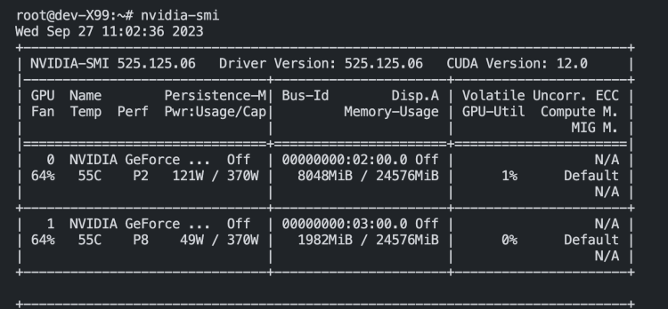
